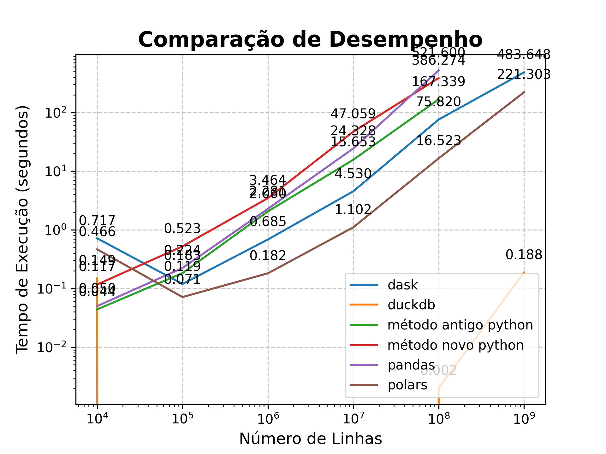

# `Um Bilhão de Linhas: Desafio de Processamento de Dados com Python`


## `Introdução`

O objetivo deste projeto é demonstrar comparações de processamento eficientemente arquivos de dados contendo:
- 10 mil linhas (~166 KB);
- 100 mil linhas (~1,6 MB);
- 1 milhão de linhas (~16,5 MB);
- 10 milhões de linhas (~165,7 MB);
- 100 milhões de linhas (~1,6 GB);
- 1 bilhão de linhas (~16 GB), especificamente para calcular estatísticas (Incluindo agregação e ordenação que são operações pesadas) utilizando Python. 

Este desafio foi inspirado no [The One Billion Row Challenge](https://github.com/gunnarmorling/1brc), originalmente proposto para Java.

O arquivo de dados consiste em medições de temperatura de várias estações meteorológicas. Cada registro segue o formato `<string: nome da estação>;<double: medição>`, com a temperatura sendo apresentada com precisão de uma casa decimal.

Aqui estão dez linhas de exemplo do arquivo:

```
Hamburg;12.0
Bulawayo;8.9
Palembang;38.8
St. Johns;15.2
Cracow;12.6
Bridgetown;26.9
Istanbul;6.2
Roseau;34.4
Conakry;31.2
Istanbul;23.0
```

O desafio é desenvolver um programa Python capaz de ler esse arquivo e calcular a temperatura mínima, média (arredondada para uma casa decimal) e máxima para cada estação, processando os resultados em uma tabela ordenada por nome da estação.

| station      | min_temperature | mean_temperature | max_temperature |
|--------------|-----------------|------------------|-----------------|
| Abha         | -31.1           | 18.0             | 66.5            |
| Abidjan      | -25.9           | 26.0             | 74.6            |
| Abéché       | -19.8           | 29.4             | 79.9            |
| Accra        | -24.8           | 26.4             | 76.3            |
| Addis Ababa  | -31.8           | 16.0             | 63.9            |
| Adelaide     | -31.8           | 17.3             | 71.5            |
| Aden         | -19.6           | 29.1             | 78.3            |
| Ahvaz        | -24.0           | 25.4             | 72.6            |
| Albuquerque  | -35.0           | 14.0             | 61.9            |
| Alexandra    | -40.1           | 11.0             | 67.9            |
| ...          | ...             | ...              | ...             |
| Yangon       | -23.6           | 27.5             | 77.3            |
| Yaoundé      | -26.2           | 23.8             | 73.4            |
| Yellowknife  | -53.4           | -4.3             | 46.7            |
| Yerevan      | -38.6           | 12.4             | 62.8            |
| Yinchuan     | -45.2           | 9.0              | 56.9            |
| Zagreb       | -39.2           | 10.7             | 58.1            |
| Zanzibar City| -26.5           | 26.0             | 75.2            |
| Zürich       | -42.0           | 9.3              | 63.6            |
| Ürümqi       | -42.1           | 7.4              | 56.7            |
| İzmir        | -34.4           | 17.9             | 67.9            |

## Dependências

Para executar os scripts deste projeto, você precisará das seguintes bibliotecas:

* Polars: `0.20.3`
* DuckDB: `0.10.0`
* Dask[complete]: `^2024.2.0`

## Execução
Foi criado um pipeline que:
1. Cria os arquivos nas quantidades de linhas acima listadas, replicando a base `weather_Stations.csv`;
2. Realiza a execução de uma função que realiza a leitura, agrupamento e ordenação utilizando cada uma das 6 tecnologias scriptadas:
2.1. Python - tecnologia 1
2.2. Python - tecnologia 2 (default Dict)
2.3. Pandas
2.4. Polars
2.5. DuckDB
2.6. Dask
3. Em cada execução acima, para cada quantidade de linhas, foi coletado o tempo de execução em segundos
4. Agrupar os tempos de execução em um Dataframe e em Gráfico

## Resultados

Os testes foram realizados em um laptop equipado com um processador Intel Core i7 e 16 GB de RAM. As implementações utilizaram abordagens puramente Python, Pandas, Polars e DuckDB e Dask. Os resultados de tempo de execução para processar o arquivo de diversas quantidades de linhas até 1 bilhão de linhas são apresentados abaixo:


| num_linhas | metodo | tempo (s) |
|---|---|---|
| 10000 | método antigo python | 0.050971 |
| 10000 | método novo python | 0.114929 |
| 10000 | pandas | 0.031983 |
| 10000 | polars | 0.199202 |
| 10000 | duckdb | 0.033999 |
| 10000 | dask | 0.727604 |
| 100000 | método antigo python | 0.183400 |
| 100000 | método novo python | 0.603653 |
| 100000 | pandas | 0.231874 |
| 100000 | polars | 0.057966 |
| 100000 | duckdb | 0.001001 |
| 100000 | dask | 0.135921 |
| 1000000 | método antigo python | 1.373214 |
| 1000000 | método novo python | 3.773457 |
| 1000000 | pandas | 2.272710 |
| 1000000 | polars | 0.161907 |
| 1000000 | duckdb | 0.001000 |
| 10000000 | método antigo python | 14.124902 |
| 10000000 | pandas | 23.693918 |
| 10000000 | dask | 4.382866 |
| 100000000 | método antigo python | 159.762853 |
| 100000000 | polars | 10.824404 |
| 100000000 | duckdb | 0.002015 |
| 1000000000 | método novo python | NaN |
| 1000000000 | pandas | NaN |
| 1000000000 | dask | 416.673630 |
| 1000000000 | duckdb | 0.204 |
| 1000000000 | polars | 176.961 |




## Explicação dos resultados
Executar 1 Bilhão de linhas (16BG) demanda recursos de hardware ou de ferramentas mais avançados para executar dentro do limite do processador físico do computador para os métodos tradicionais, enquanto bibliotecas como Dask, Polars e DuckDB provaram ser excepcionalmente eficazes, requerendo menos linhas de código devido à sua capacidade inerente de distribuir os dados em "lotes em streaming" de maneira mais eficiente.

- Na tecnologia antiga de Python retorna `MemoryError`, visto a limitação física.
- Na tecnologia novo Python o tempo de execução passou de 1h e não foi computado.
- Na tecnologia Pandas, retornou `ParserError`, visto a limitação física de memória RAM.

Para todos os casos acima, há possibilidades de contornar o problema, como implementar o processamento em "lotes", mas foge ao escopo deste projeto.

## Conclusão

[em andamento]


# `Como Executar`

Para executar este projeto e reproduzir os resultados:

1. Clone esse repositório
2. Instalar versão do pyenv `pyenv install 3.12.1`
3. Definir a versao do Python usando o `pyenv local 3.12.1`
4. `poetry env use 3.12.1`, `poetry install --no-root` e `poetry lock --no-update` (este para evitar atualizações futuras)
5. Execute o comando `python src/create_measurements.py` para gerar o arquivo de teste
6. Tenha paciência e vá fazer um café, vai demorar uns 10 minutos para gerar o arquivo
7. Certifique-se de instalar as versões especificadas das bibliotecas Dask, Polars e DuckDB
8. Execute os scripts `python src/using_python.py`, `python src/using_pandas.py`, `python src/using_dask.py`, `python src/using_polars.py` e `python src/using_duckdb.py` através de um terminal ou ambiente de desenvolvimento que suporte Python.

Este projeto destaca a versatilidade do ecossistema Python para tarefas de processamento de dados, oferecendo valiosas lições sobre escolha de ferramentas para análises em grande escala.

## Bônus

Para rodar o script Bash descrito, você precisa seguir alguns passos simples. Primeiro, assegure-se de que você tenha um ambiente Unix-like, como Linux ou macOS, que suporta scripts Bash nativamente. Além disso, verifique se as ferramentas utilizadas no script (`wc`, `head`, `pv`, `awk`, e `sort`) estão instaladas em seu sistema. A maioria dessas ferramentas vem pré-instalada em sistemas Unix-like, mas `pv` (Pipe Viewer) pode precisar ser instalado manualmente.

### Instalando o Pipe Viewer (pv)

Se você não tem o `pv` instalado, pode facilmente instalá-lo usando o gerenciador de pacotes do seu sistema. Por exemplo:

* No Ubuntu/Debian:
    
    ```bash
    sudo apt-get update
    sudo apt-get install pv
    ```
    
* No macOS (usando [Homebrew](https://brew.sh/)):
    
    ```bash
    brew install pv
    ```
    
### Preparando o Script

1. Dê permissão de execução para o arquivo script. Abra um terminal e execute:
    
    ```bash
    chmod +x process_measurements.sh
    ```

2. Rode o script. Abra um terminal e execute:
   
   ```bash
   ./src/using_bash_and_awk.sh 1000
   ```

Neste exemplo, apenas as primeiras 1000 linhas serão processadas.

Ao executar o script, você verá a barra de progresso (se pv estiver instalado corretamente) e, eventualmente, a saída esperada no terminal ou em um arquivo de saída, se você decidir modificar o script para direcionar a saída.

## Próximos passos

Esse projeto faz parte da *Jornada de Dados*
Nossa missão é fornecer o melhor ensino em engenharia de dados

Se você quer:

- Aprender sobre Duckdb e engenharia de dados
- Construir uma base sólida em Python e SQL
- Criar ou melhorar seu portfólio de dados
- Criar ou aumentar o seu networking na área
- Mudar ou dar o próximo passo em sua carreira
